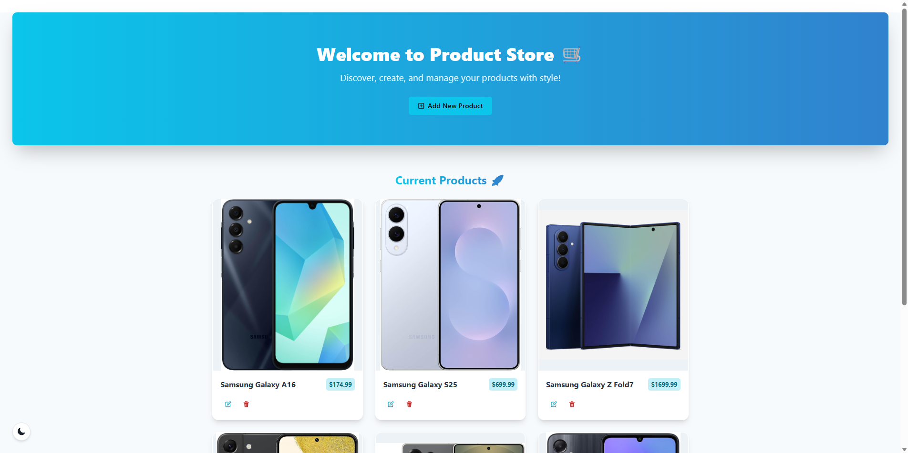
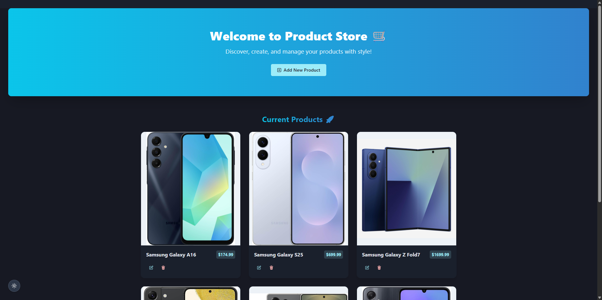
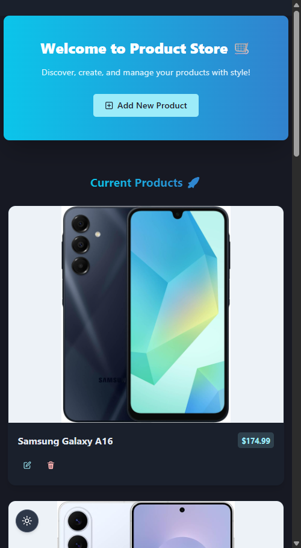
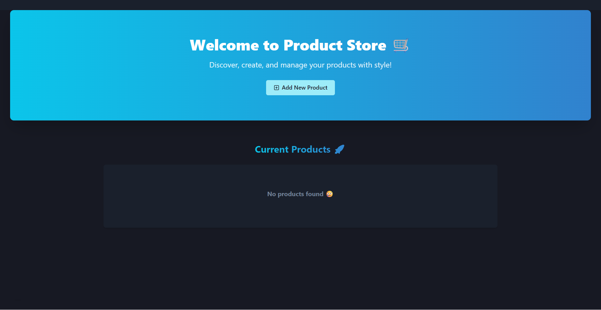
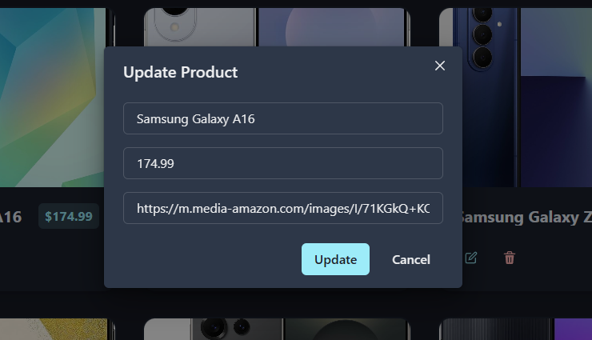
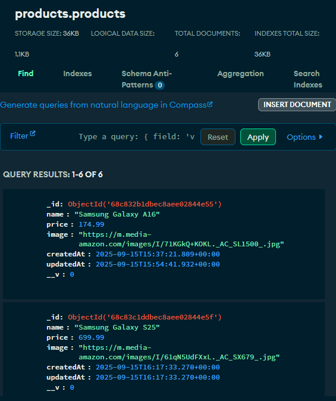
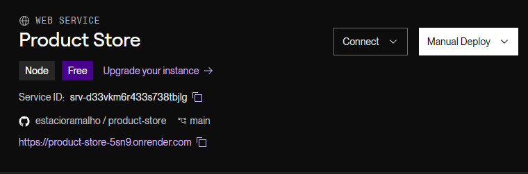

# Product Store 🛒

A Full Stack web application for managing products.

## 🧑‍💻 Tech Stack

- **Frontend:** React, Chakra UI, Zustand, Vite
- **Backend:** Express, MongoDB, Mongoose, dotenv
- **Dev Tools:** Nodemon
- **Deployment:** Render

---

## ✨ Features

- **Product Management:** Create, update, and delete products.
- **Responsive UI:** Clean, mobile-friendly interface using Chakra UI.
- **Instant Feedback:** Toast notifications for all actions.
- **Dark/Light Mode:** Toggle color modes for comfortable viewing.

---

## 🚀 Screenshots

**Home Page**

**Update Product**

**Create Product**

**Database**

**Deployment**

---
